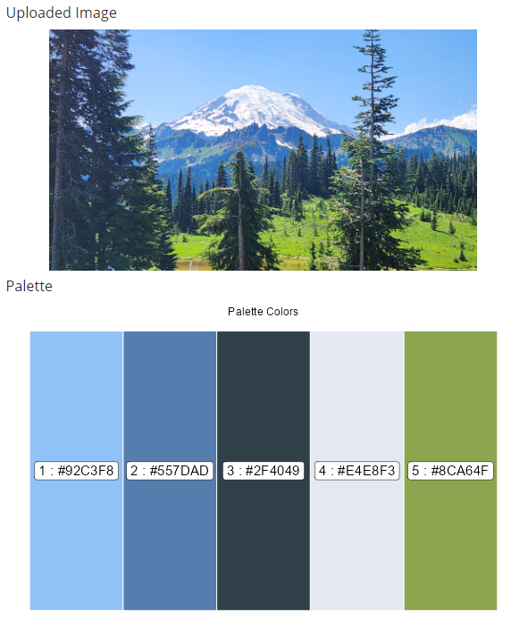

# **PixToPalette: Generate a Custom Color Palette from Your Images**

## **Overview**

PixToPalette is a Shiny application that allows users to upload an image and generate a custom color palette based on the dominant colors in the image. By using k-means clustering, the app identifies the key colors in the image, providing a versatile tool for designers, data scientists, and anyone who needs a tailored color scheme. Users can select the number of colors they want in their palette, ensuring flexibility for various use cases.

### **Inspiration**

The idea for this app originated from my search for a suitable color palette for a work-related dashboard. I wanted a palette that perfectly complemented the dashboard’s cover image. During this search, I came across the [National Park Palette repository](https://github.com/kevinsblake/NatParksPalettes) on GitHub, which inspired me to create a tool to generate custom palettes from any image.

The app’s foundation lies in the principles outlined in an [R-bloggers article](https://www.r-bloggers.com/2018/11/utilizing-k-means-to-extract-colours-from-your-favourite-images/). I refined the code presented in the article to suit my needs and integrated it into a user-friendly Shiny application.

## **Features**

-   **Image Upload**: Upload your favorite image (PNG or JPEG format).\
-   **Color Palette Customization**: Select the number of colors (clusters) for your palette.\
-   **Interactive Visualization**: View the dominant colors and their proportions in your image.\
-   **Downloadable Palette**: Save the generated color palette for use in your projects.

## **How It Works**

1.  **Image Processing**: The app reads the uploaded image and converts it into a data matrix of pixel values.\
2.  **K-Means Clustering**: Using k-means clustering, the app groups pixel colors into user-specified clusters.\
3.  **Palette Generation**: The app extracts the dominant colors and displays them as a palette.\
4.  **User Interaction**: The user can adjust the number of clusters and regenerate the palette to meet their needs.

## **Installation and Usage**

### **Prerequisites**

-   R (\>= 4.0.0)\
-   Shiny package

### **Clone the Repository**

git clone <https://github.com/terri-pietka-ds/PixToPalette.git>\
cd PixToPalette

## **Repository Structure**

-   `app.R`: Defines the user interface of the app and contains the server-side logic\
-   `library/`: Contains the functions for image processing, k-means clustering and palette visualization.\
-   `www/`: Contains assets for styling the app.\
-   `examples/`: Includes example images for testing.

## **Shiny Link**

You can access the web link for the online app here:

<https://terripietka.shinyapps.io/PixToPalette/>

## **Examples**

Here are a couple examples of a generated palette from sample images:

1.  **Sedona**:

2.  **Mount Rainier**:

## **License**

This project is licensed under the Apache 2.0 License. See the LICENSE file for details.

## **Credits**

-   [National Park Palette](https://github.com/kevinsblake/NatParksPalettes) for inspiration.\
-   [R-bloggers](https://www.r-bloggers.com/2018/11/utilizing-k-means-to-extract-colours-from-your-favourite-images/) for the foundational k-means clustering code.

## **Contributing**

Contributions are welcome! Feel free to open an issue or submit a pull request if you have ideas for new features or improvements.

## **Contact**

If you have any questions or suggestions, feel free to contact me at [terripietka\@gmail.com](mailto:terripietka@gmail.com){.email}
